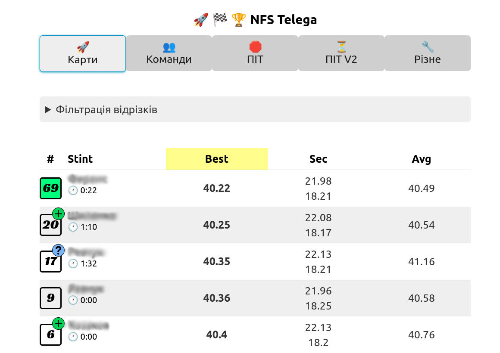
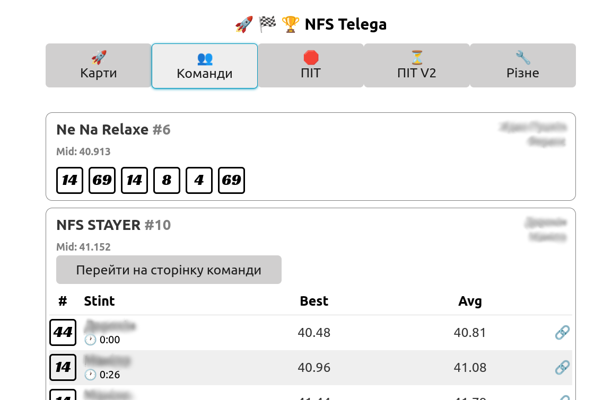

### NFS-timings

Simple app that gathers and displays
karts statistics during endurance karting races
in "Need For Speed" Kyiv karting center.

Main page example

Teams data example

### Basic architecture

* Simple django app with Jinja2 templates to show kart stats
* [htmx](https://htmx.org/) for interactivity and SPA-like behaviour (when needed)
* Separate worker that queues racing API every few seconds and
performs laps and pilots detection
* Postgres DB to store requests and detected laps
* [Materialized view](stats/stints.py) to aggregate data per-team and per-kart
* Services are run on basic VPS using docker-compose
* Basic django-admin setup to control whether to query API
  (do not send requests when there is no race running)
* Simulation script that runs test dataset and emulates real karting dashboard
  (used for test and debug purposes)
