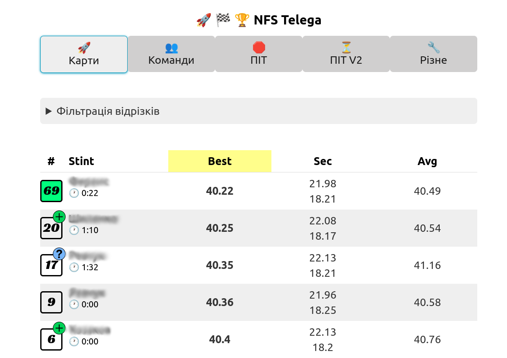
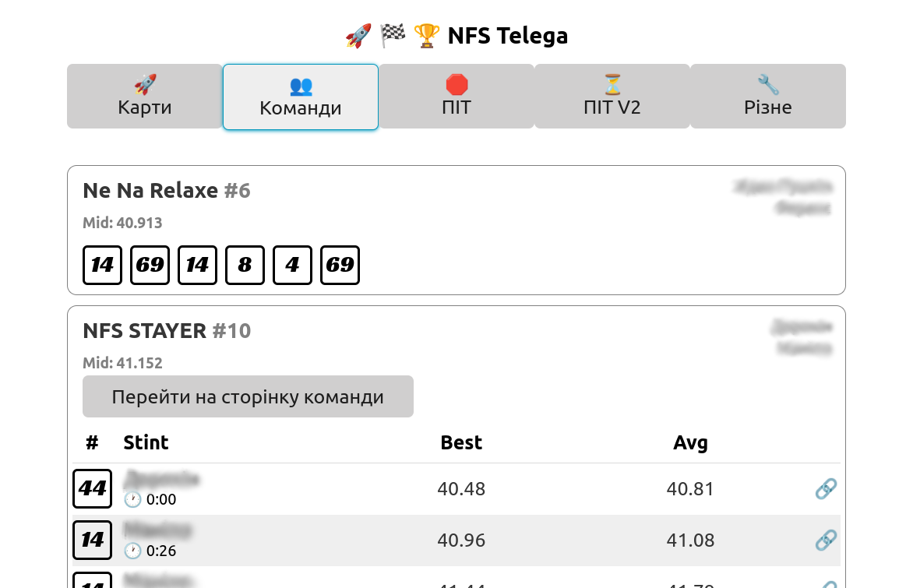

### NFS-timings

Simple app that gathers and displays
karts statistics during endurance karting races
in "Need For Speed" Kyiv karting center.

Main page example


Teams data example



### Basic architecture

* Simple django app with Jinja2 templates to show kart stats
* [htmx](https://htmx.org/) for interactivity and SPA-like behaviour (when needed)
* Separate worker that queues racing API every few seconds and
performs laps and pilots detection
* Postgres DB to store requests and detected laps
* [Materialized view](stats/stints.py) to aggregate data per-team and per-kart
* Services are run on basic VPS using docker-compose
* Basic django-admin setup to control whether to query API
  (do not send requests when there is no race running)
* Simulation script that runs test dataset and emulates real karting dashboard
  (used for test and debug purposes)

### First-time Docker setup

To create a local or production-style Docker setup, including a fresh `.env`,
database schema, materialized `stints` view, and administrator account, run:

```bash
python3 scripts/bootstrap.py
```

The script prompts for database and admin credentials and generates a Django
secret key. It can optionally replay and fully ingest a Parquet recording (the
repository fixture is `tests/bg_13_may_q1h.parquet`). Add `--reset` only when you
explicitly want to delete the existing Docker Compose database volume:

```bash
python3 scripts/bootstrap.py --reset --recording tests/bg_13_may_q1h.parquet
```

The simulator is served on port 7000 during a recording import. See
`python3 scripts/bootstrap.py --help` for details.
